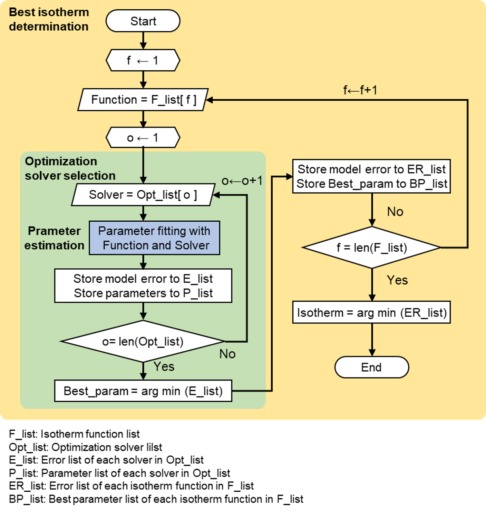

Isotherm fitting module (:py:mod:`pyAPEP.isofit`)
====================================================

:py:mod:`isofit` is a module used to define isotherm functions from pressure and uptake data samples. Three main functions are developed in this module—:py:mod:`best_isomodel`, :py:mod:`diff_T`, and :py:mod:`IAST`. :py:mod:`best_isomodel` automatically finds the best isotherm function for the pure component. :py:mod:`diff_T` derives isotherms according to temperature and pressure, and :py:mod:`IAST` derives mixture isotherms using single isotherms, respectively.

First, import isofit into Python after installation.

.. code-block:: python

   import pyapep.isofit as isofit

In this module, three main functions exist.

   1. Finding best isotherm function (:py:mod:`isofit.best_isomodel`) 
   2. Fitting isotherm for different temperature (:py:mod:`isofit.fit_diffT`)
   3. Developing mixuture isotherm with IAST (:py:mod:`isofit.IAST`)

Detailed description of each function are described in next senction. The explanation include function usage, algorithm (or related theroy), and function structure.

---------------------

Usage
------

1. Finding best isotherm function
'''''''''''''''''''''''''''''''''''''

:py:mod:`best_isomodel` automatically finds the best isotherm function from a given pressure-uptake dataset with multiple isotherm and optimizer candidates. In this usage example, the isotherm function is found from a dummy dataset with gas uptake at four pressures (2, 3, 4, 5 bar). The function :py:mod:`best_isomodel` returns 4 elements: isotherm function, estimated parameters of isotherm function, the type of isotherm, and validation error of the model.

.. code-block:: python

   # Package import
   import pyapep.isofit as isofit

   # Generate dummy data
   P = [2, 3, 4, 5]
   q_comp1 = [1, 2, 3, 4]     # Gas adsorption of a component

   # Define pure isotherm of each component
   iso1, param1, fntype1, err1 = isofit.best_isomodel(P, q_comp1)

2. Fitting isotherm for different temperature
'''''''''''''''''''''''''''''''''''''''''''''''''

To reflect the temperature influence on the adsorption equilibrium, adsorption isotherm data measured at different pressure and temperatures should be used in composing an isotherm model. :py:mod:`fit_diffT` finds the isotherm model considering both pressure and temperature effects.

.. code-block:: python

   # Generate a data dummy data
   qm_dum = 4.5 # mol/kg
   K1_dum = 3.0 # 1/bar
   K2_dum = 0.5 # 1/(bar^2)
   P_dum = np.linspace(0, 2, 9)
   T_dum = [280, 300, 305, 310, 320] # dummy T
   dH_dum = 25000 # J/mol : heat of adsorption
   R_gas = 8.3145
   T_ref = T_dum[1] # Reference temperature = 300 K

   q_dum = []
   for T in T_dum:
      P_norm = np.exp(dH_dum/R_gas*(1/T - 1/T_ref))*P_dum
      err_dum = 0.05*np.random.rand(len(P_norm))
      q_tmp = qm_dum*(K1_dum*P_norm + 2*K2_dum*P_norm**2)/(
               1+ K1_dum*P_norm + K2_dum*P_norm**2)
      q_w_err = q_tmp + err_dum
      q_dum.append(q_w_err)
   # Use isofit
   P_list = [P_dum,]*len(q_dum)
   res_diffT = isofit.fit_diffT(P_list,q_dum, T_dum, 1, tol = 2E-4)
   iso_function, iso_param, zerr = res_diffT[:3]
   fit_error, dH_found, Tref_found, theta_list = res_diffT [3:]
   print("This data is fitted with {}.".format(zerr))

   # Prediction for different T
   P_pred = np.linspace(0,2.5, 51)
   q_pred = []
   for T in T_dum:
      q_tmp =iso_function(P_pred, T)
      q_pred.append(q_tmp)

3. Developing mixuture isotherm with IAST
'''''''''''''''''''''''''''''''''''''''''''

:py:mod:`IAST` provides Ideal adsorbed solution theory (IAST) calculation. IAST is widely used for predicting the isotherm of multiple components using pure isotherm models for each gas component. 

.. code-block:: python

   # Pure isotherm functions
   def iso1(P,T):
      deno = 1 + 0.3*P
      nume = 2*0.3*P
      return  nume/deno
   def iso2(P,T):
      deno = 1 + 0.3*P + 0.1*P**2
      nume = 2*(0.3*P + 2*0.1*P**2)
      return nume/deno
   def iso3(P,T):
      return 2*P**0.4

   iso_list = [iso1, iso2, iso3]
   P_arr = np.linspace(0,4,9)  # pressure (bar)
   T = 300    # temperature (K) 
   y_gas = [] # mole fraction (mol/mol)
   y1 = [0, 0.2, 0.4, 0.6] # mol. frac. of 1 (mo/mol)
   for y in y1:
      y_tmp = np.array([y, 0.6-y, 0.4])
      y_gas.append(y_tmp)
   q_comp1 = []
   q_comp2 = []
   for yy in y_gas:
      res_list = []
      q1_tmp = []
      q2_tmp = []
      for p in P_arr:
         res_tmp = isofit.IAST(iso_list,p*yy, T)
         res_list.append(res_tmp)
         q1_tmp.append(res_tmp[0])
         q2_tmp.append(res_tmp[1])
      q_comp1.append(q1_tmp)
      q_comp2.append(q2_tmp)

----------------------------------------

Function structures
---------------------

.. currentmodule:: pyAPEP.isofit

.. autofunction:: best_isomodel

.. currentmodule:: pyAPEP.isofit

.. autofunction:: fit_diffT

.. currentmodule:: pyAPEP.isofit

.. autofunction:: IAST

------------------------------------------------

Theory
--------

Finding best isotherm function algorithm
''''''''''''''''''''''''''''''''''''''''''

A primary function, :py:mod:`best_isomodel`, automatically determines the best isotherm function from a given pressure-uptake dataset. Figure below shows the algorithm of :py:mod:`best_isomodel`. The algorithm consists of three main stages. First, the parameter was estimated using a given isotherm function and an optimization solver. In the next stage, the best optimization solver with the least error was identified by repeatedly solving the objective problems using five optimization solvers. Finally, the best isotherm function among the five isotherm candidates was found by repeating the first and second stages. A detailed explanation of each stage is provided below:

Figure shows the algorithm of :py:mod:`isofit.best_isomodel`. The algorithm consists of three stages. First, the parameter estimation is carried out with a given isotherm function and an optimization solver. The next stage finds the best optimization solver with the least error by repeatedly solving the objective problems with five optimization solvers. Lastly, the best isotherm function is found among five isotherm candidates by repeating the first and second stages. A detailed explanation of each stage is described followings.

Parameters estimation of the isotherm function is the same as solving an optimization problem as followings:

.. math::

    J = \min_{K_1, K_2, ...} \left( \sum_{i=1}^{N_{fit}} (q_i-\hat{q}_i)^2 \right )

.. math::

    \hat{q} = f(P, T, K_1, K_2, ...)

where :math:`q`, :math:`N_{fit}`, and :math:`K` refer to gas uptake, the number of data samples for isotherm fitting, and isotherm parameters, respectively. :math:`f` means the isotherm function, and :math:`\hat{q}` is the predicted uptake from :math:`f`. By solving the objective function, the isotherm parameters are derived that satisfy the minimum error between actual and predicted uptake data.

To find the best isotherm parameters,  :py:mod:`isofit.best_isomodel` function considers five optimization solvers. Optimization solvers are given by the public python package, scipy, and those are Nelder-mead, Powell, COBYLA, shgo, and differential evolution. The optimization solver (s) with the minimum objective function is selected and the isotherm function is derived as the following equation, and :math:`Opt\_list` refers to the list of five solvers.

.. math::

    s = \arg\min_{Opt\_list}(J)

The best isotherm function with the smallest objective function value is derived by solving the above equations with to five isotherm functions. Five isotherm functions are described in Table __ and :math:`F\_list` denotes the list of isotherm functions. Then, the best solver and parameters could be found for each isotherm function. 

.. math::

    f = \arg\min_{F\_list}(J(s))

:py:mod:`isofit` estimates the parameters for adsorption isotherm models. If the user provides a list of adsorption isotherm models to fit the data, the :py:mod:`isofit` module uses the default list of isotherm models. The default list includes the following default isotherm models---Langmuir, Freundlich, Quadratic, Sips, and Dual-site Langmuir isotherm models. These isotherm models are described using the following equations as in below table. 

+-----------+--------+--------------------------------------------------------------------------------------------+
| # of      | Name   | Equation                                                                                   |
|parameters |        |                                                                                            |
+===========+========+============================================================================================+
|     1     | Arrh   | :math:`q(P) =e^{\frac{\vartriangle H}{R} \left (\frac {1}{T}-\frac {1}{T_{ref}} \right)}`  |
+-----------+--------+--------------------------------------------------------------------------------------------+
|     2     | Lang   | :math:`q(P) = M\frac{KP}{1+KP}`                                                            |
+           +--------+--------------------------------------------------------------------------------------------+
|           | Freu   | :math:`q(P) = kP^n`                                                                        |
+-----------+--------+--------------------------------------------------------------------------------------------+
|     3     | Quad   | :math:`q(P) = M \frac{(K_a + 2 K_b P)P}{1+K_aP+K_bP^2}`                                    |
+           +--------+--------------------------------------------------------------------------------------------+
|           | Sips   | :math:`q(P) =\frac{q_m K P^n}{1+K P^n}`                                                    |
+-----------+--------+--------------------------------------------------------------------------------------------+
|     4     | DSLang | :math:`q(P) = M_1 \frac{K_1 P}{1+K_1 P} +  M_2 \frac{K_2 P}{1+K_2 P}`                      |
+-----------+--------+--------------------------------------------------------------------------------------------+

Langmuir isotherm model is an isotherm model derived from the assumption that identical elementary adsorption sites exist on the adsorbent surface. The Langmuir isotherm model is also know as simple Langmuir or Single-site Langmuir isotherm model to be distinguished from multi-site Langmuir models. Freundlish model is an empirically deduced isotherm model. Although it is well know that Freundlich model is neither physically nor thermodynamically consistent, this model has been widely used still today. Moreover, Quadratic isotherm model is the simplest cooperative adsorption isotherm model. Quadratic isotherm model assumes identical adsorption sites hosting multiple adsorbate molecules. In addition, Sips model is a combination of Langmuir and Freundlich isotherm models. While Sips model follows Freundlich isotherm model at low pressure, the model predicts the saturation of the adsorbent at high pressure as Langmuir isotherm model does. Lastly, Dual-site Langmuir model is the most well-known multisite Langmuir isotherm model. Dual-site Langmuir isotherm model is derived from the assumption t that there exist two distinct types of adsorption sites. These default adsorption isotherm models are considered to select the best adsorption isotherm model for the given data in :py:mod:`isofit` module.

.. note::
   The user should provide a data sample in consideration of the number of parameters of the model to be used as candidates. For example, if you want to include the Dualsite Langmuir function in candates, the user needs more than three data samples.

Adosption at different temperature (using heat of adsorption)
'''''''''''''''''''''''''''''''''''''''''''''''''''''''''''''''

This :py:mod:`isofit` module also provides the function to derive the isotherm function depending on the different temperatures. Using the Arrhenius equation, gas uptake could be calculated at a given temperature.

.. math::
   a(P, T) = \exp { \frac { \vartriangle H_{ads,i}}{R}\left( \frac{1}{T}-\frac{1}{T_{ref}}\right)},

where :math:`\Delta H` and :math:`R` are the heat of adsorption and gas constant, respectively. Subscript :math:`ref` refers to the reference condition.

Since adsorption isotherm models have been suggested with uptake-pressure data at a constant temperature, the methods for estimating the isotherm parameters have been discussed in the previous section. However, the influence of temperature is also important to predict the adsorption behaviors in various applications such as the adsorption-based separation or storage processes. 

To reflect the temperature influence on the adsorption equilibrium, adsorption isotherm data measured at different pressure and temperatures should be used in composing an isotherm model. The proposed package, pyAPEP, provides a function :py:mod:`diff_T` where the isotherm model considering both pressure and temperature effects is found. The function assumes followings:

   * The influence of temperature on the adsorption isotherm follows the Clausius-Clapeyron relation since adsorption is considered as a phase change from gas phase to solid phase. This allows the temperature effect to be expressed as the Arrhenius equation.
   * Heat of adsorption is constant for different temperatures and pressure, which is a key parameter expressing the extent of the thermal sensitivity to the adsorption.

Once we have uptake-pressure data for different temperatures, the assumptions allow the pressure data to be normalized as expressed in follwing equation. 

.. math::
   P_{norm} = P\times \exp{\left( \frac{\Delta H_{ad}}{R_{gas}} \left(\frac{1}{T} - \frac{1}{T_{ref}} \right)\right)}

:math:`P_{norm}`, :math:`\Delta H_{ad}`, and :math:`R_{gas}` are normalized pressure, heat of adsorption, and gas constants, respectively. As given data, temperature and pressure are expressed with :math:`P` and :math:`T`.

The pressure should be normalized to make the uptake and normalized pressure data be aligned on a single reference curve, overlapping one another as shown in Figure {fig:sec3:qP_compare}. If the reference curve is expressed with :math:`f_{ref}`, assigning proper :math:`\theta` to each temperature makes all the data overlapped in below equation.

.. math::
   q_{T{j}} = f_{ref}(P_{norm}) = f_{ref}(P\times \theta_{T_{j}})

The problem of finding the best :math:`\theta` value is formulated as an optimization problem minimizing the difference between the uptake data and predicted uptake from the reference curve as shown in following equation.

.. math::
   \min_{\theta_{T_{j}}} \left( f_{ref}(P\times \theta_{T_{j}}) - q_{T_{j}} \right)^{2}

The :math:`\theta_{T_{j}}` values matches to each temperature (:math:`T_{j}`), and they are correlated with a parameter, heat of adsorption (:math:`\Delta H_{ad}`). From the first assumption, the parameter :math:`\theta_{T_{j}}` can be expressed with following equation, which indicates that the heat of adsorption (:math:`\Delta H_{ad}`) parameterizes the temperature influences of the adsorption isotherm curves. 

.. math::
   \theta_{T_{j}, pred} = \exp{\left( \frac{\Delta H_{ad}}{R_{gas}}\left(\frac{1}{T_{j}} - \frac{1}{T_{ref}} \right)\right)}

Using the temperature and :math:`\theta_{T_{j}}` data, therefore, the heat of adsorption can be obtained as a solution of below optimization problem.

.. math::
   \min_{\Delta H_{ad}} \left( \theta_{T_{j}, pred} - \theta_{T_{j}} \right)^{2}

To find an isotherm model as a function of both pressure and temperature, an isotherm model explaining the reference curve should be found. Since the normalized pressure can be expressed with a function of pressure, the algorithm is employed, which provides the best isotherm model for a reference function, :math:`f_{ref}(P)`.

Using the model and parameters found above, the prediction of uptake (:math:`q`) is realized with the equation: 

.. math::
   q = f_{ref}(P\times\exp{\left( \frac{\Delta H_{ad}}{R_{gas}} \left( \frac{1}{T} - \frac{1}{T_{ref} }\right) \right)})

Ideal adsorbed solution theory (IAST)
''''''''''''''''''''''''''''''''''''''''

To derive the mixture isotherm function, pyapep.isofit module provides Ideal adsorbed solution theory (IAST) calculation. IAST is widely used for predicting the isotherm of multiple components using pure isotherm models for each gas component. The assumptions in IAST are described below. Detailed descriptions of the theory refer to [46].

   * The temperature is fixed and the pure isotherm are measured at the same temperature.
   * The thermodynamic property of the adsorbent during the adsorption is negligible.
   * Each adsorbate has access to the same area of adsorbent surface.
   * A Gibbs dividing surface defines an adsorbed phase.

From Raoults' law, we need to find solid mole fraction :math:`x_i`, which is the uptake.

.. math::
   P_{i}^{\circ} = y_i\frac{P}{x_i}

.. math::
   \pi_{i}^{\circ} = \frac{\pi_i}{RT} = \int_{0}^{P^{\circ}}\frac{f_i(P)}{P}\,dP

where, :math:`\pi_{i}^{\circ}` is the reduced spreading pressure, :math:`f_i(P)` is the pure isotherm model. For components :math:`i = 1, 2, ..., n`, the pure component spreading pressure :math:`\pi_i` at pressure :math:`P^{\circ}_i` are all equal to the spreading pressure of the mixture :math:`\pi`.

.. math::
   \pi = \pi_1(P^{\circ}_1) = \pi_2(P^{\circ}_2) = \cdots = \pi_N(P^{\circ}_n)

.. math::
   \min_{x_1, x_2, ... x _n} \sum_{i=1}^n \sum_{j \ne i}^{n-1} (\pi^{\circ}_i - \pi^{\circ}_j)^2

The spreading pressures for all components are calculated with :math:`x_{guess}` until the difference between the spreading pressure of each component is minimized. :math:`\pi_i` and :math:`x_i` are derived by solving above equation, and the gas uptake of each component is calculated by the followings,

.. math::
   q_i = q_{total}\cdot x_i \\
    \textrm{where} \;\frac{1}{q_{total}} = \sum_{i=1}^{n} \frac{x_i}{f_i(P^{\circ}_i)} 

During the implementation of IAST, implicit calculations are required to find the adsorption equilibrium. In pyAPEP proposed in this work, the implicit calculations are solved using the optimization method. The formulated optimization problem is illustrated in below equation. 

.. math::
   \min_{x_{1}, x_{2}, \dots}{\sum_{j = 1}^{n}\left( {h_{j}(x_{j}, y_{j}, P, T)- {h_{1}(x_{1}, y_{1}, P, T)}} \right)^{2} }

.. math::
   \pi_{i} = h_{i}(x_{i}, y_{j}, P, T)

Suppose that the function :math:`h_j` is the computations of the spreading pressure of component :math:`j(π_i)`. The function :math:`h_j` is a function of the given initial guess of solid phase mole fraction (:math:`x_j`), gas phase mole fraction :math:`y_j`, pressure(:math:`P`), and temperature(:math:`T`).

For efficient computation, this work suggests a new method. Selecting the initial guess of solid phase mole fraction (:math:`x_{j}`) is the most important part. To find the initial guess in an efficient way, this work proposes a new method. The method uses the extended Langmuir isotherm model for the initial guess. 

Since the extended Langmuir isotherm has explicit equation structure, it takes significantly short time to calculate the Langmuir isotherm equation solution. However, the problem is that the extended Langmuir isotherm model is not applicable to the other isotherm models than Langmuir model as a pure isotherm model. For example, if one component follows Freundlich isotherm model, the Langmuir isotherm model parameters cannot be found.

To overcome this problem, the method proposed in this work estimates effective values of the Langmuir isotherm model parameters (:math:`q_{m,eff,i}` and :math:`b_{eff,i}`). This method firstly assumes that the isotherm model behaves in the similar way of Langmuir isotherm model. For given isotherm model :math:`f_{i}(P_{i})`, the effective Langmuir parameters are found as following equations. 

.. math::
   q_{m, eff,i} = f_{i}(P_{H})

.. math::
   q_{i} = f_{i}(P_{i})

.. math::
   b_{eff,i} = \frac{q_{i}}{q_{m,eff,i}-q_{i}}

In the equations, :math:`P_{high}` is a huge pressure enough to saturate the adsorbent while :math:`P_{i}` is current partial pressure. By applying those effective Langmuir parameters to extended Langmuir isotherm model as shown in below equations, practical initial guess (:math:`x_{i,init}`) is found for solving the optimization problem.

.. math::
   q_{i,init} = \frac{q_{m,eff,i}b_{eff,i}P_{i}}{1+\sum_{j} b_{eff,j}P_{j}} 

.. math::
   x_{i,init} = \frac{q_{i,init}}{\sum_{j}{q_{j,init}}}

The effective Langmuir parameters are similar to finding a hydraulic diameter for pipes with different shapes. Although various hydraulic dimensionless numbers are defined based on the pipe diameter, the diameter cannot be found in the pipes with other shapes than circle. As an important hydraulic feature, the hydraulic diameter of different cross-sectional  shape is calculated with the ratio between the area and perimeter.

------------------------------------------------------------------------------------------------------------------------------------------------------------------------------------------------------------------------------------------------------------------------------------------------------------------------------------------------------------------------
